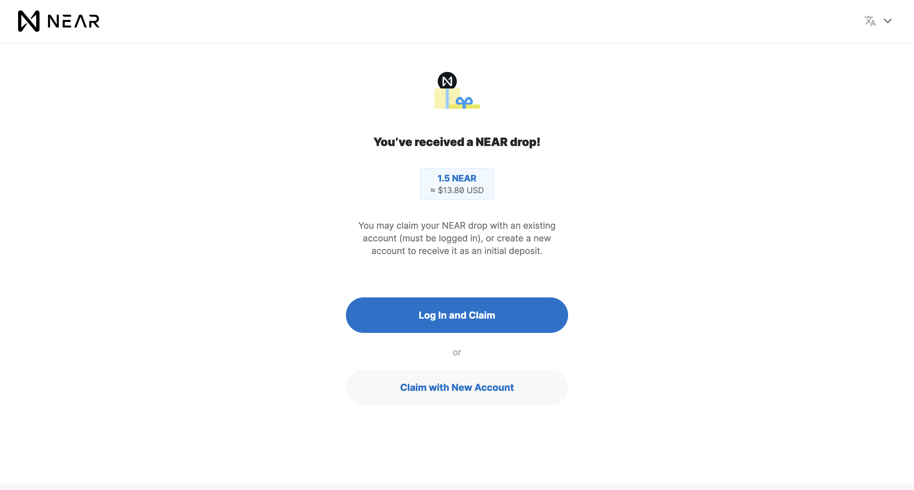

# Linkdrops

* [What is a linkdrop](#what-is-a-linkdrop)
* [Creating a linkdrop](#creating-a-linkdrop)
* [Wallet linkdrop page](#wallet-linkdrop-page)

## What is a linkdrop?

Linkdrops allow you to send funds to anyone via a link. The reciever of a linkdrop can add the funds to their existing account or create a new account to claim the funds.




## Creating a linkdrop
1. Generate a `KeyPair`.
2. Call the `send` method of an account that has a [linkdrop contract](https://github.com/near/near-linkdrop) deployed with the `publicKey` and an attached amount of NEAR you want to send*.
3. Use the `secretKey` as the `fundingKey` in the link.

Example:
```js
const fundingContractAccountId = "near";
const linkdropKeyPair = KeyPairEd25519.fromRandom();
await linkdropSenderAccount.functionCall(
            fundingContractAccountId,
            "send",
            { public_key: linkdropKeyPair.publicKey.toString() },
            null,
            new BN(parseNearAmount("2.5"))
        );
console.log(`https://wallet.near.org/${fundingContractAccountId}/${linkdropKeyPair.secretKey}`);
```

In this example, we call `send` on the `near` top-level account. The `near` and `testnet` top-level accounts both have linkdrop contracts and are commonly used for this purpose. The [linkdrop-proxy](https://github.com/near-apps/linkdrop-proxy) contract can be used to deploy a linkdrop contract to any account while still having it create a `near` or `testnet` subaccount (as opposed to only it's own subaccount) and works by proxy calling the `create_account` method.

To be able to create accounts on the wallet from linkdrops, call `send` on either a [near-linkdrop](https://github.com/near/near-linkdrop) contract on `near`/`testnet` top-level account or a [linkdrop-proxy](https://github.com/near-apps/linkdrop-proxy) contract on any account.

*The [near-linkdrop](https://github.com/near/near-linkdrop) contract deducts 1Ⓝ when calling `send` to cover account creation via an access key.

## Wallet linkdrop page

     /linkdrop/{fundingContractAccountId}/{linkdropKeyPairSecretKey}?redirectUrl={redirectUrl}
    
* `fundingContractAccountId`: The contract accountId that was used to send the funds.
* `linkdropKeyPairSecretKey`: The corresponding secret key to the public key sent to the contract.
* `redirectUrl`: The url that wallet will redirect to after funds are successfully claimed to an existing account. The URL is sent the accountId used to claim the funds as a query param.
