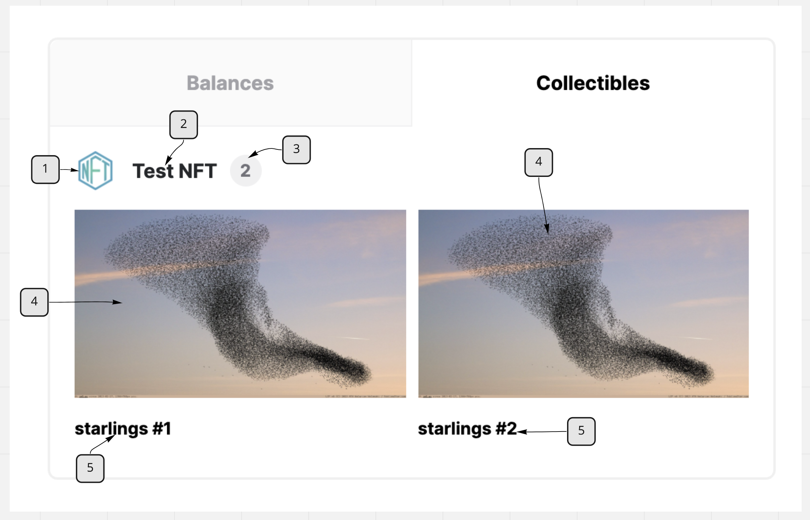

NEAR Wallet Non-Fungible Token ([NEP-171](https://nomicon.io/Standards/NonFungibleToken/Core.html)) Discovery and Display
===

NEAR Wallet discovers non-fungible tokens using a range of indexer queries and displays them using data in the token's metadata per the Non-Fungible Token Metadata spec ([NEP-177](https://nomicon.io/Standards/NonFungibleToken/Metadata.html))

## Contents

1. [NEAR Wallet non-fungible token discovery](#NEAR-Wallet-non-fungible-token-discovery)
2. [NEAR Wallet non-fungible token display](#NEAR-Wallet-non-fungible-token-display)

## NEAR Wallet non-fungible token discovery
The wallet will consider contracts as non-fungible token contracts relevant to the user if they meet any of the following conditions:

1. Any account makes a call to the contract with any method prefixed with `nft_` and the `receiver_id` property of the `args` is the user's account ID.

2. The contract emits a [Non-Fungible Token Event](https://nomicon.io/Standards/NonFungibleToken/Event.html#interface) with `NftTransferLog` data and the `new_owner_id` value is the user's account ID.

NEAR Wallet then makes a call to `nft_metadata` to fetch the NFT contract's [metadata](https://nomicon.io/Standards/NonFungibleToken/Metadata.html) as `NFTContractMetadata` and then calls `nft_tokens_for_owner` with the `accountId` arg set to the user's account ID to retrieve the tokens owned by the user per the [NFT enumeration spec (NEP-181)](https://nomicon.io/Standards/NonFungibleToken/Enumeration.html). This will include the [`TokenMetadata`](https://nomicon.io/Standards/NonFungibleToken/Metadata.html#interface) used to display the tokens.

## NEAR Wallet non-fungible token display
The NFT is then displayed as follows:

1. This is the icon for the NFT contract. It's retrieved from the `icon` prop of `NFTContractMetadata` and is rendered if it's a [data URI](https://developer.mozilla.org/en-US/docs/Web/HTTP/Basics_of_HTTP/Data_URIs).
2. This is the `name` prop of the `NFTContractMetadata`. It will link to the NFT contract's account page on [explorer](https://explorer.near.org/).
3. This is the length of the list of tokens returned by the NFT contract's `nft_tokens_for_owner`.
4. This is the image of the token. It's displayed as the `media` prop of [`TokenMetadata`](https://nomicon.io/Standards/NonFungibleToken/Metadata.html#interface) if it's a url or a [data URI](https://developer.mozilla.org/en-US/docs/Web/HTTP/Basics_of_HTTP/Data_URIs). Otherwise the `media` prop is appended to the `base_uri` prop of `NFTContractMetadata` (fetched from `nft_metadata`) and if `base_uri` is not set, then to `https://cloudflare-ipfs.com/ipfs/` and that is used as the url.
5. This is the `title` prop of [`TokenMetadata`](https://nomicon.io/Standards/NonFungibleToken/Metadata.html#interface)