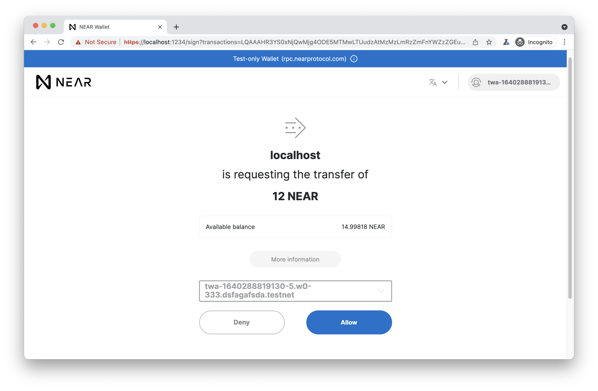

Signing transactions
===

Signing a transaction or series of transactions on NEAR Wallet involves constructing the transaction and then using `near-api-js` to redirect the user to the wallet. Once the user approves (or denies) the transaction, they will be redirected to the original url or a pre-specified url. 

## Steps

1. [Construct a transaction](#Construct-a-transaction)
2. [Setup `WalletConnection` and call `requestSignTransactions`](#Setup-WalletConnection-and-callrequestSignTransactions)
3. [Wallet redirect and callback](#Wallet-redirect-and-callback)

## Construct a transaction
At a high level, constructing a transaction is done by calling `createTransaction` from `near-api-js`:

```javascript=
const nearAPI = require("near-api-js");

const transaction = nearAPI.transactions.createTransaction(
  sender,
  publicKey,
  receiver,
  nonce,
  actions,
  recentBlockHash
);
```

More information on each argument can be found [here](https://docs.near.org/docs/tutorials/create-transactions#transaction-requirements).

## Setup `WalletConnection` and call`requestSignTransactions`

Setup a `WalletConnection` instance by passing in your `Near` instance. You can then call `requestSignTransactions` on the `WalletConnection` instance:

```javascript=
const nearAPI = require("near-api-js");
const { connect, WalletConnection } = nearApi;

const near = await connect(config);

const walletConnection = new WalletConnection(near);

// redirect to wallet to sign the transaction
walletConnection.requestSignTransactions({
    transactions: [transaction],
});
```
More information on setting up a connection to NEAR [here](https://docs.near.org/docs/tutorials/create-transactions#setting-up-a-connection-to-near).

`requestSignTransactions` takes in an `options` argument of type `RequestSignTransactionsOptions`:

```typescript=
RequestSignTransactionsOptions {
    /** list of transactions to sign */
    transactions: Transaction[];
    /** url NEAR Wallet will redirect to after transaction signing is complete */
    callbackUrl?: string;
    /** meta information NEAR Wallet will send back to the application. `meta` will be attached to the `callbackUrl` as a url search param */
    meta?: string;
}
```

* The `transactions` property is required and it's a list of transactions that can be created using the method [above](#Construct-a-transaction).
* `callbackUrl` is optional and will default to the current url `window.location.href` when not provided.
* `meta` is optional and can include any information that we'd like forwarded to the `callbackUrl` by the wallet as the `meta` search param.

## Wallet URL API

The `/sign` path of the wallet recognizes the following url parameters:

| Param          | Description                                                                                                      |
| -------------- | ---------------------------------------------------------------------------------------------------------------- |
| `transactions` | A comma seperated list of transactions serialized in [borsh](https://borsh.io/) and then encoded in base64       |
| `callbackUrl`  | The url to [redirect to](#Wallet-redirect-and-callback) after the flow is completed with success or error params |
| `meta`         | Any data the integrator wants passed to the `callbackUrl`                                                        |

### Serializing transactions in [borsh](https://borsh.io/)
A transaction is serialized using [borsh](https://borsh.io/) as follows:

```javascript=
const { transactions } = require("near-api-js");
const borsh = require("borsh");

const tx = {
  "signerId": "sender.near",
  "publicKey": {
    "keyType": 0,
    "data": {
      "0": 199,
      "1": 84,
      // ...
    }
  },
  "nonce": 123456,
  "receiverId": "receiver.near",
  "actions": [
    {
      "createAccount": {},
      "enum": "createAccount"
    },
    {
      "transfer": {
        "deposit": "1000000000000000000000000"
      },
      "enum": "transfer"
    }
  ],
  "blockHash": {
    "type": "Buffer",
    "data": [
      30,
      179,
     // ...
    ]
  }
}

const serializedTx = borsh.serialize(transactions.SCHEMA, tx); // -> Buffer <0B, 00, 00, 00, 73, 65, 6E, 64, 65, 72, 2E, 6E, 65, 61, 72, 00, 25, 62, 11, 78, BC, E5, 68, B9, 9C, 2E, 7A, …>
// borsh.serialize is also re-exported by near-api-js as utils.serialize.serialize
```

The transactions then need to be outputted as `base64` to be passed to the wallet:

```javascript=
const serializedEncodedTx = serializedTx.toString('base64'); // -> "CwAAAHNlbmRlci5uZWFyAGT3V2lh0VAA/mrod+KWM30Iae3jRgA4Uum87Q4YvR6WQOIBAAAAAAANAAAAcmVjZWl2ZXIubmVhch6z3oIrhTeXGliWsOilax3Aoq0rrwkYdb8fNSw75IW3AgAAAAADAAAAoe3MzhvC0wAAAAAAAA=="
```


### Example usage of wallet URL API

```
GET https://wallet.near.org/sign?transactions=CwAAAHNlbmRlci5uZWFyAGT3V2lh0VAA/mrod+KWM30Iae3jRgA4Uum87Q4YvR6WQOIBAAAAAAANAAAAcmVjZWl2ZXIubmVhch6z3oIrhTeXGliWsOilax3Aoq0rrwkYdb8fNSw75IW3AgAAAAADAAAAoe3MzhvC0wAAAAAAAA==&callbackUrl=https%3A%2F%2Fwww.google.com&meta=test
```

## Wallet redirect and callback
The user will be presented with a request to sign the transaction(s) that were passed in in the wallet UI: 




Once the user allows or denies the transaction, they will be redirected to `callbackUrl` with the following parameters:

* `transactionHashes`: a comma seperated string of the transaction hashes of the approved transactions if successful.
* `meta`: the meta search param that was passed by the original URL.
* `errorCode`: The eror code (if any) encountered when signing the transaction.
* `errorMessage`: The error message for the error encountered when signing.